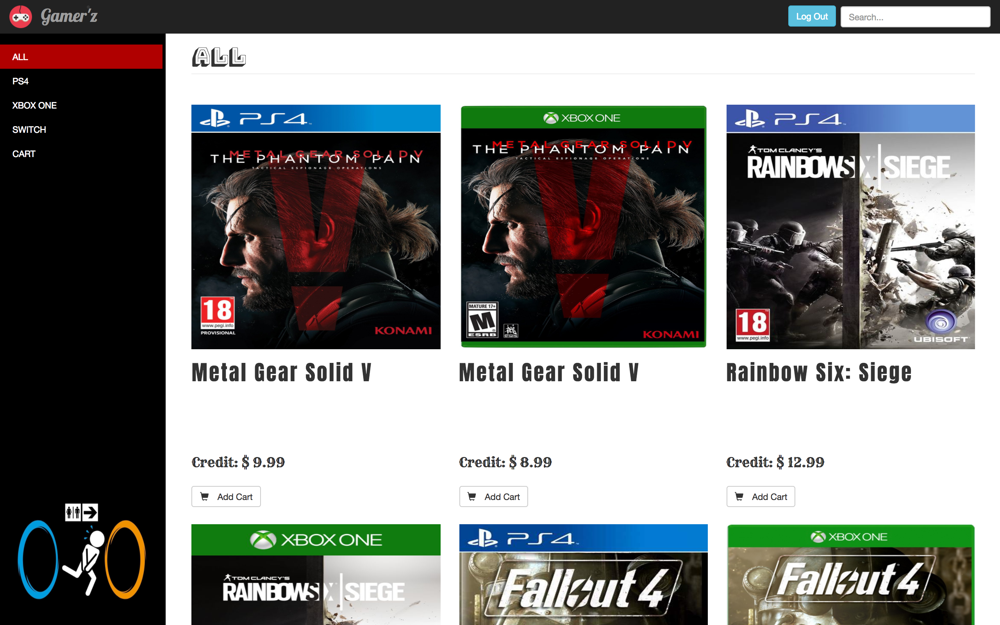
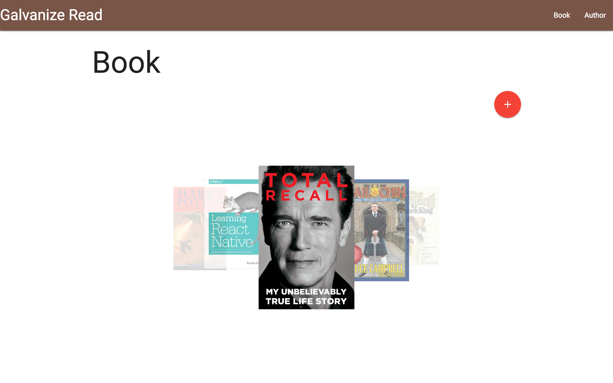

# Moe's Portfolio

<!DOCTYPE html>
<html>
  <head>
    <meta charset="utf-8">
    <meta name="viewport" content="width=device-width, initial-scale=1, shrink-to-fit=no">
    <title></title>
    <link rel="stylesheet" href="https://maxcdn.bootstrapcdn.com/bootstrap/4.0.0-beta/css/bootstrap.min.css" integrity="sha384-/Y6pD6FV/Vv2HJnA6t+vslU6fwYXjCFtcEpHbNJ0lyAFsXTsjBbfaDjzALeQsN6M" crossorigin="anonymous">
    <link href="./assets/css/main.css" rel="stylesheet">
  </head>
  <body>
    <body>

    <nav class="navbar navbar-expand-md navbar-dark fixed-top bg-dark">

      <button class="navbar-toggler" type="button" data-toggle="collapse" data-target="#navbarCollapse" aria-controls="navbarCollapse" aria-expanded="false" aria-label="Toggle navigation">
        
      </button>
      

        <ul class="navbar-nav mr-auto">
          <li class="nav-item active">
            <a class="nav-link" href="#">Home (current)</a>
          </li>
          <li class="nav-item">
            <a class="nav-link" href="#">Link</a>
          </li>
          <li class="nav-item">
            <a class="nav-link disabled" href="#">Disabled</a>
          </li>
        </ul>
      

    </nav>

    

      <ol class="carousel-indicators">
        <li data-target="#myCarousel" data-slide-to="0" class=""></li>
        <li data-target="#myCarousel" data-slide-to="1" class=""></li>
        <li data-target="#myCarousel" data-slide-to="2" class="active"></li>
      </ol>
      

        

          
          

            

              <h1>Football Genie</h1>
              
Football Genie project helps users to save their time for searching and having easy access to the detail of soccer leagues, players and teams.

              
<a class="btn btn-lg btn-primary" href="#" role="button">View Detail</a>

            

          

        

        

          
          

            

              <h1>Another example headline.</h1>
              
A place where you can check how much your game title is worth to sell. You can search the game titles by searching it by name or platform. 

              
<a class="btn btn-lg btn-primary" href="#" role="button">View Detail</a>

            

          

        

        

          
          

            

              <h1>Galvanize Reads</h1>
              
GoodReaders is a book catalog service that stores a list of recommended books and authors that the user can search by author or book. The user can also add, edit or delete either book or author.

              
<a class="btn btn-lg btn-primary" href="#" role="button">View Detail</a>

            

          

        

      

      <a class="carousel-control-prev" href="#myCarousel" role="button" data-slide="prev">
        
        Previous
      </a>
      <a class="carousel-control-next" href="#myCarousel" role="button" data-slide="next">
        
        Next
      </a>
    

    <!-- Marketing messaging and featurettes
    ================================================== -->
    <!-- Wrap the rest of the page in another container to center all the content. -->

    

      <!-- Three columns of text below the carousel -->
      

        

          
          <h2 class="col-image">Football Genie</h2>
          
Football Genie project helps users to save their time for searching and having easy access to the detail of soccer leagues, players and teams.

          
<a class="btn btn-secondary col-detail" href="#" role="button">View details »</a>

        
<!-- /.col-lg-4 -->
        

          
          <h2 class="col-image">Gamer'z</h2>
          
A place where you can check how much your game title is worth to sell. You can search the game titles by searching it by name or platform. 

          
<a class="btn btn-secondary col-detail" href="#" role="button">View details »</a>

        
<!-- /.col-lg-4 -->
        

          
          <h2 class="col-image">Galvanize Read</h2>
          
GoodReaders is a book catalog service that stores a list of recommended books and authors that the user can search by author or book. The user can also add, edit or delete either book or author.

          
<a class="btn btn-secondary col-detail" href="#" role="button">View details »</a>

        
<!-- /.col-lg-4 -->
      
<!-- /.row -->

      <!-- START THE FEATURETTES -->

      

      

        

          <h2 class="featurette-heading">First featurette heading. It'll blow your mind.</h2>
          
Donec ullamcorper nulla non metus auctor fringilla. Vestibulum id ligula porta felis euismod semper. Praesent commodo cursus magna, vel scelerisque nisl consectetur. Fusce dapibus, tellus ac cursus commodo.

        

        

          
        

      

      

      

        

          <h2 class="featurette-heading">Oh yeah, it's that good. See for yourself.</h2>
          
Donec ullamcorper nulla non metus auctor fringilla. Vestibulum id ligula porta felis euismod semper. Praesent commodo cursus magna, vel scelerisque nisl consectetur. Fusce dapibus, tellus ac cursus commodo.

        

        

          
        

      

      

      

        

          <h2 class="featurette-heading">And lastly, this one. Checkmate.</h2>
          
Donec ullamcorper nulla non metus auctor fringilla. Vestibulum id ligula porta felis euismod semper. Praesent commodo cursus magna, vel scelerisque nisl consectetur. Fusce dapibus, tellus ac cursus commodo.

        

        

          
        

      

      

      <!-- /END THE FEATURETTES -->

      <!-- FOOTER -->
      <footer>
        
        
        
        
© 2017 Company, Inc. · <a href="#">Privacy</a><a href="#">Terms</a>

      </footer>

    
<!-- /.container -->

    <svg xmlns="http://www.w3.org/2000/svg" width="500" height="500" viewBox="0 0 500 500" preserveAspectRatio="none" style="display: none; visibility: hidden; position: absolute; top: -100%; left: -100%;"><defs></defs><text x="0" y="25" style="font-weight:bold;font-size:25pt;font-family:Arial, Helvetica, Open Sans, sans-serif">500x500</text></svg></body>

    
    
    
    
  </body>
</html>
